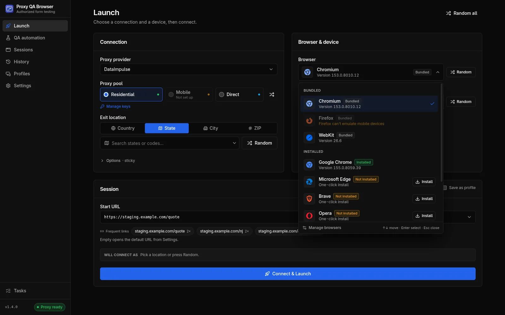
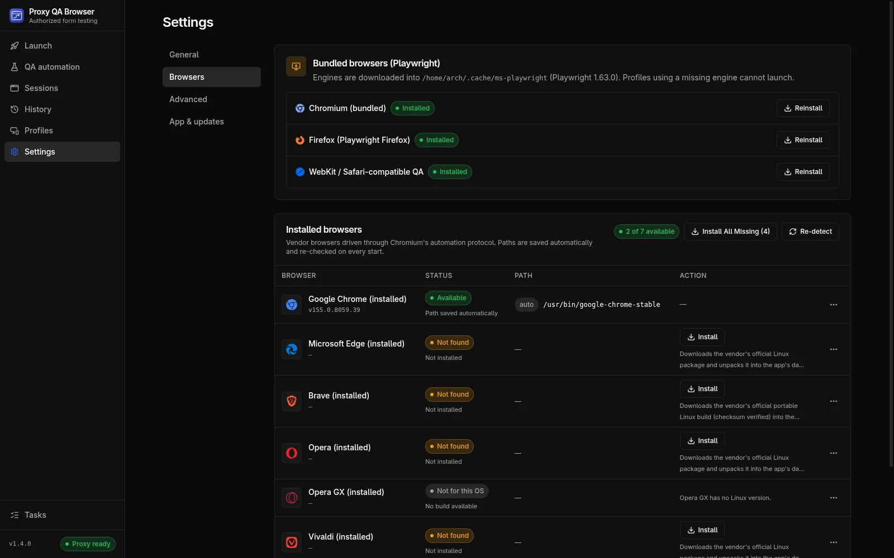

# Browsers

Proxy QA Browser drives bundled Playwright engines and the Chromium-family browsers installed on your computer, installs most of them in one click, and detects them without ever starting them. For a task-level guide, see [free cross-browser testing](/use-cases/cross-browser-testing).

## Supported browsers

| Engine | Label in the app | Kind | Linux | Windows | macOS |
| --- | --- | --- | --- | --- | --- |
| `chromium` | Chromium (bundled) | Bundled, **required** | Inside the AppImage | Downloaded by the app | Downloaded by the app |
| `firefox` | Firefox (Playwright Firefox) | Bundled | Inside the AppImage | Downloaded by the app | Downloaded by the app |
| `webkit` | WebKit / Safari-compatible QA | Bundled | Inside the AppImage | Downloaded by the app | Downloaded by the app |
| `chrome` | Google Chrome (installed) | Installed | One click (official `.deb`, unpacked) | One click (winget, machine-wide; may show a UAC prompt) | **Get** |
| `msedge` | Microsoft Edge (installed) | Installed | One click (official `.deb`) | Usually preinstalled; otherwise one click (winget) | **Get** |
| `brave` | Brave (installed) | Installed | One click (official portable `.zip`, size and SHA-256 checked) | One click (winget, per user) | **Get** |
| `opera` | Opera (installed) | Installed | One click (official `.deb`) | One click (winget, per user) | **Get** |
| `opera-gx` | Opera GX (installed) | Installed | Not available (no Linux build) | One click (winget, per user) | **Get** |
| `vivaldi` | Vivaldi (installed) | Installed | One click (official `.deb`) | One click (winget, per user) | **Get** |
| `system-chromium` | Chromium (system install) | Installed | Your package manager (for example `sudo pacman -S chromium` or `sudo apt install chromium`); detected automatically | One click (winget) | **Get** |

The bundled engines come from Playwright 1.63: Chromium 153, Firefox 155 and WebKit 26.6. **WebKit is not Apple Safari**; it is the open-source engine Safari is built on, labelled "WebKit / Safari-compatible QA" everywhere in the app.

**Installed browsers are the real browsers.** They are started through Chromium's automation protocol with their own executable, so the window really is Chrome, Edge, Brave or Opera and identifies as itself. Each launch uses a fresh temporary browser profile; your own bookmarks, cookies and extensions are never touched.

## Managing browsers

Open **Settings → Browsers**:

- **Bundled browsers (Playwright)**: Chromium, Firefox and WebKit with their status, **Install** / **Reinstall** buttons and **Install All Missing**. In the AppImage this card shows **Bundled** and no install buttons.
- **Installed browsers**: the seven vendor browsers with **Status** (*Detected automatically*, *Custom path*, *Path saved automatically*, *Not installed* or *No build available*), version, **Path** and **Action**: **Install** (one click), **Get** (opens the vendor page, for example **Get Google Chrome**) or **Uninstall** (only for copies the app installed). The header shows *"N of 7 available"*, **Install All Missing (N)** and **Re-detect**.
- Each row's **…** menu sets, changes or clears a **custom path**.
- The footer shows where engines live, with **Reveal Folder**.

You can also install a missing browser from the browser picker on the Launch page.

### One-click installs on Linux (no root)

The app downloads the vendor's **official** package and unpacks it into `<userData>/data/installed-browsers/<engine>/`. No root, no package manager, on any x86-64 distribution. A failed update leaves the previous version working. The browsers still need the usual desktop libraries (NSS, GTK and so on) that any desktop distribution has; unpacking some packages needs the `xz` tool.

On non-x86-64 Linux the vendor packages are not available and the **Get** button (vendor download page) is used instead.

### One-click installs on Windows (winget)

The app runs `winget install` silently, with `--scope user` for Brave, Opera, Opera GX and Vivaldi so no administrator rights are needed. "Already installed" counts as success. Installers are kept from opening browser windows, and after the install the app closes only windows that the installer started; your own browser windows are never touched.

Without winget (App Installer), every vendor browser falls back to the **Get** button, which opens the vendor download page.

### macOS and the Get button

On macOS every vendor browser uses the **Get** button. The app opens the vendor's download page; drag the browser into `/Applications` or `~/Applications`. The app checks every 5 seconds, for up to 15 minutes, whether the browser has appeared, then saves its path and shows a toast. The app never runs a vendor `.pkg` installer.

### Uninstall

**Uninstall** removes only a copy the app installed itself (Linux: `<userData>/data/installed-browsers/<engine>`) and forgets its saved path. Browsers installed any other way, including winget installs on Windows, are never touched; remove those with your system's tools.

## Background tasks

Every install and uninstall runs as a background task on a serial queue: one at a time, in order. The sidebar's **Tasks** button opens **Background tasks**, which shows each task's state: **Queued**, **Installing · 42%**, **Verifying…**, **Verified ✓**, **Uninstalled**, **Failed** (with the reason) or **Cancelled**, plus **Cancel** and **Retry**. **Clear Finished** removes finished entries. The last 20 finished tasks are kept across restarts.

After each install the app verifies the browser without opening a window:

1. The executable (or Playwright's install marker) exists.
2. Its version can be read.
3. A **headless** test launch (start, new page, `about:blank`, close) succeeds within 30 seconds.
4. The executable path is saved.

Only then is the task **Verified ✓**; otherwise it fails with *"Installed, but failed verification: …"* with the reason and **Retry**. **Cancel** stops the installer and every process it started. Launching a browser whose task is queued or running is refused with `ENGINE_BUSY`.

## How detection works

Detection **never starts a browser** to find it. For each installed browser the app checks, in order:

1. The saved path (yours or the one the app saved), if the file exists.
2. The app's own install folder.
3. Well-known locations, for example `%PROGRAMFILES%\Google\Chrome\Application\chrome.exe`, `/usr/bin/google-chrome-stable` or `/Applications/Google Chrome.app`.
4. The `PATH`.

The version is read without running the browser on Windows (from the `.exe` version resource) and on macOS (from the app bundle's `Info.plist`). On Linux the app runs `<browser> --version`, which prints and exits. Results are cached for 60 seconds; **Re-detect** scans again at once.

### Saved paths

After every detection and install, the executable's path is saved automatically (chip **auto**). A path you set yourself (chip **custom**) wins whenever the file exists and is never overwritten; a custom path that points nowhere is reported as *"Custom path not found, ignored"*. An automatic path whose file has disappeared is dropped, so settings copied to another computer repair themselves.

Do not point a custom path at a Snap or Flatpak wrapper script; use the real browser binary.

## Extra Chromium flags

**Settings → Advanced → Browser flags → Extra Chromium flags** adds command-line flags, one per line (`--flag` or `--flag=value`), to every Chromium-family launch, bundled and installed. Firefox and WebKit ignore them.

## Known limitations

- **Vivaldi** installs and is detected, but Vivaldi 8.2 hangs under automation when the first page is created. Its install task ends with *"Vivaldi installed but does not support automation; choose another engine."*, and a launch fails after the 45-second start-up limit. Use another browser.
- **Firefox** cannot emulate phones or tablets. See [Locations and devices](/docs/locations-and-devices#browser-compatibility).
- **WebKit on Linux** needs glibc 2.38 or newer. See [Install](/docs/install#linux).
- **WebKit with an authenticated proxy** goes through a small local relay on `127.0.0.1`, because Playwright's WebKit cannot open HTTPS connections through a proxy that needs a password. The credentials never reach the browser process. See [Security and privacy](/docs/security-and-privacy#local-relay-for-webkit).
