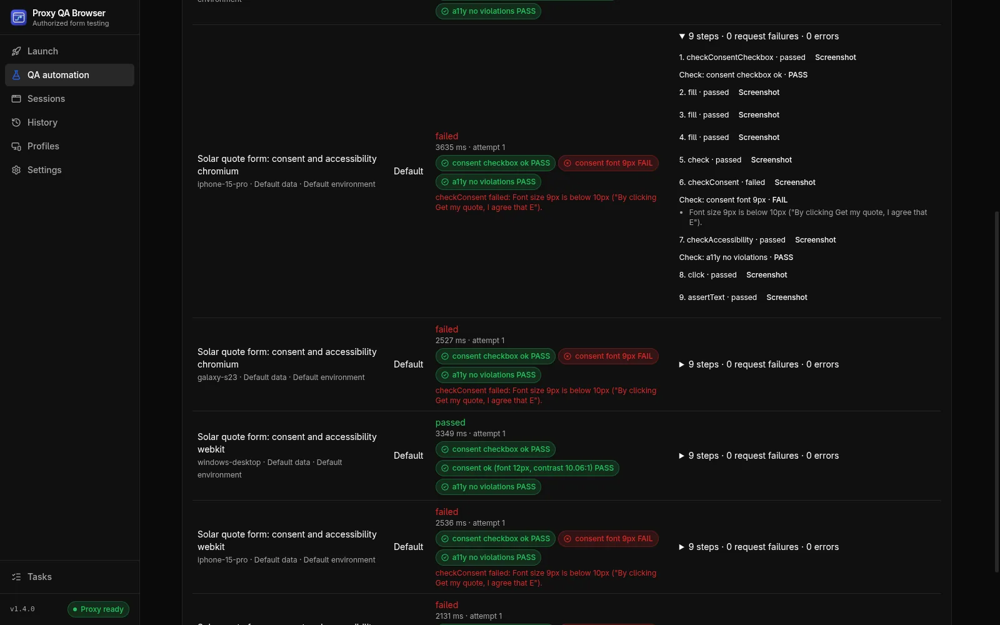

# Consent, accessibility and performance checks

Checks are assertion steps that inspect the page your scenario has reached and record evidence: consent disclosures and checkboxes, lead-certificate scripts, axe-core accessibility rules and performance budgets. For the end-to-end workflow, see [TCPA consent testing](/use-cases/tcpa-consent-testing); for phones and tablets, see [small-screen disclosure checks](/use-cases/device-testing).

## How checks work

Checks only read what your own page renders and loads; scrolling the checked element into view is the one interaction. They never contact a third-party service, never change the browser's identity and never try to get past bot protection. If protection blocks your QA runs, allowlist them with a [site access token](/docs/site-access-tokens).

| Step (editor label) | What it asserts | Main fields (default) |
| --- | --- | --- |
| `checkConsent` (Check consent disclosure) | The consent or TCPA disclosure is present, worded as approved, visibly rendered, large enough, legible and near the submit button | `blockSelector` or `blockText`; `approvedText` (optional, `{{variables}}` allowed); `wordingMatch` (`exact`); `minFontPx` (10); `minContrastRatio` (4.5); `nearSelector` (optional); `maxDistancePx` (200) |
| `checkConsentCheckbox` (Check consent checkbox) | The consent checkbox is **not pre-checked** and has a label | `checkboxSelector` |
| `checkScriptLoaded` (Check script loaded) | A lead-certificate script loaded and did its work | `preset`: `trustedform`, `jornaya` or `custom`; `scriptUrl`, `inputSelector`, `globalName` (optional; `scriptUrl` required for custom) |
| `checkAccessibility` (Check accessibility (axe)) | No axe-core violations at or above an impact level | `scopeSelector` (whole page); `tags` (`wcag2a`, `wcag2aa`); `failOn` (`serious`); `maxNodes` (5) |
| `checkPerformance` (Check performance budget) | Page metrics are within budget; all metrics are always recorded | `budgets` (`lcpMs`, `cls`, `inpMs`, `tbtMs`, `ttfbMs`, `domContentLoadedMs`, `loadMs`, `transferBytes`; none by default); `settleMs` (1000) |

Common behaviour:

- **Continue on failure.** Every check accepts `continueOnFailure` (**Continue if this check fails** in the editor). A failed check then records its evidence, marks the case failed and lets the remaining steps run, so one run reports every problem on the page. Without it a failed check stops the case like any other assertion.
- **WARN.** A check can end as a warning: recorded in results and reports but not failing, for example when contrast is not measurable.
- **No healing.** Like other assertions, checks never use self-healing fallbacks.
- **Variables.** Selectors, `blockText`, `approvedText`, `scriptUrl` and `inputSelector` accept `{{variables}}`.

Scenarios, backups and CI manifests saved before checks existed load unchanged.

## Consent disclosure (`checkConsent`)

The step runs these checks in order:

1. **Present.** The block is found by CSS selector, or by a distinctive phrase (`blockText`, the smallest element containing it), within the step timeout. When several elements match, the first is checked and a warning says so.
2. **Wording.** The block's rendered text is compared with `approvedText` after normalizing whitespace (including non-breaking and zero-width spaces) and Unicode composition. Punctuation, quotes and case must match. `exact` requires equal text; `contains` allows other text around it. A mismatch fails with a word-level diff, for example `… may [-call and text-] {+contact+} me …`, where `[-…-]` is approved but missing and `{+…+}` appears only on the page.
3. **Visible.** The block is scrolled into view, then fails when it or an ancestor is `display:none`, it has `visibility:hidden`, its combined opacity is below 0.1, it has no size, it is clipped away, it is still outside the viewport, or **another element covers its centre** (a modal, sticky footer or cookie banner). The covering element is named in the evidence.
4. **Font size.** The smallest rendered font size of the block's visible text, in CSS pixels and including transforms, must be at least `minFontPx`.
5. **Contrast.** For each visible text run, the text colour is composited over its ancestors' backgrounds and the WCAG 2 contrast ratio is computed. The lowest ratio must be at least `minContrastRatio`. With a background image or gradient behind the text, or a colour outside sRGB, the ratio is **not measurable** and the step records a warning; verify those by hand. There is no large-text exception; set 3 for disclosures that are WCAG large text.
6. **Near.** With `nearSelector`, the gap between the two boxes must be at most `maxDistancePx`.

The matrix headline names what failed, for example `consent font 9px`, `consent contrast 2.31:1`, `consent hidden (display:none)` or `consent wording differs`.

Limitations: overlap is tested at the centre only; a background painted by a non-ancestor element is not seen by the contrast measurement; frames and shadow DOM are not searched.

## Consent checkbox (`checkConsentCheckbox`)

Place it **before** any step that ticks the box. It fails when the box is checked (`checked`, or `aria-checked="true"` for a `role="checkbox"` element), when the element is not a checkbox, or when it has no label (a `<label>`, `aria-label`, `aria-labelledby` or `title`). A box that the HTML marks checked but a script unchecked is a warning.

## Lead-certificate scripts (`checkScriptLoaded`)

Use this step to check that the TrustedForm or Jornaya LeadiD script loaded on your form, or a custom lead-certificate script. It waits up to the step timeout for the page's own script to finish:

| Preset | Passes when |
| --- | --- |
| **TrustedForm** | A script from `api.trustedform.com` (or a subdomain) loaded and a hidden input whose name contains `TrustedFormCertUrl` holds a `https://cert.trustedform.com/…` certificate URL |
| **Jornaya LeadiD** | A script from `create.lidstatic.com` loaded and the hidden input `#leadid_token` is populated |
| **Custom** | A script URL pattern matches (`*` matches anything), plus an optional populated input (CSS selector) and/or an initialized global (dotted name such as `vendor.ready`) |

The token or certificate value is **never recorded**, only whether it is populated and its length. The runner never calls these services itself; the page's own script contacts its vendor exactly as it would for a visitor, so use the vendor's test or staging configuration where it offers one.

TrustedForm, Jornaya and LeadiD are trademarks of their owners; this project is not affiliated with them.

## Accessibility (`checkAccessibility`)

Runs [axe-core](https://github.com/dequelabs/axe-core) by Deque (bundled, MPL-2.0) in the page's main frame with the chosen rule tags (`wcag2a`, `wcag2aa`, `wcag21aa`, `wcag22aa`, `best-practice` and others), optionally scoped to one element.

- Violations at or above `failOn` (`minor` < `moderate` < `serious` < `critical`) fail the step; lower ones are a warning.
- Evidence lists each violation's rule ID, impact, help text and link, the number of failing elements and up to `maxNodes` element selectors.
- Frames are not scanned.

Automated rules find a subset of WCAG issues. They do not replace a manual accessibility review.

## Performance (`checkPerformance`)

When a scenario contains this step, the runner installs performance observers before the first navigation. The step waits for the `load` event, waits `settleMs` more, then reads the current document's metrics.

| Metric | Source | Availability |
| --- | --- | --- |
| LCP | Largest Contentful Paint entries | Chromium, Firefox, WebKit |
| CLS | Layout-shift entries, largest session window | Chromium |
| INP | Event Timing, slowest interaction (needs a click or key press in an earlier step) | Chromium, Firefox, WebKit |
| TBT | Long tasks after first contentful paint, time beyond 50 ms | Chromium |
| TTFB, DOMContentLoaded, load | Navigation Timing | All (WebKit reports no TTFB for documents the runner fetches) |
| Transfer size | Navigation and resource timing (cross-origin resources without `Timing-Allow-Origin` count as 0) | All |

A metric over its budget fails the step (equal passes). A budgeted metric the browser does not report is a warning, never a pass. TTFB includes the runner's own document fetch, so compare budgets between runs of this tool rather than with field data.

**Network throttling.** Set **Network throttling** in the scenario editor (`"networkProfile": "slow-3g" | "fast-3g" | "4g"` in JSON) to emulate the Chrome DevTools presets for every case. It applies to Chromium-family engines only; other engines run unthrottled, the case notes say so and performance checks show a warning. Subresources are throttled; the document itself is not.

## Results

Each case lists its checks with a status and a headline. **Results** shows a summary above the matrix with every failed or warning check, for example `Apple iPhone SE (3rd gen) · WebKit · Texas: consent font 9px FAIL`, a badge per check in each case, and the evidence under each step. JSON exports contain everything; JUnit adds a `check` property and a `system-out` line per check; the HTML report adds a **Checks** table.



## Pre-launch consent QA workflow

Run this before a lead form goes live, and after every change to its disclosure, layout or vendor scripts.

1. **Use staging and synthetic data.** Point the scenario at a staging environment (an [environment](/docs/automation#suites-and-environments) makes the switch explicit) and submit only synthetic test leads that your systems tag as tests.
2. **Build the scenario.** Navigate to the form; add `checkConsentCheckbox` before any step that ticks the box; add `checkConsent` with the disclosure selector, the wording approved by your compliance team in `approvedText`, and `nearSelector` set to the submit button; add `checkScriptLoaded` for TrustedForm or Jornaya; add `checkAccessibility` scoped to the form. Turn on **Continue if this check fails** for each check.
3. **State-specific wording.** Put each state's approved disclosure in a dataset variable (`{"disclosure": "…"}`) and use `{{disclosure}}` as the approved text. Each dataset row runs separately and is named in results.
4. **Run the matrix.** Choose the devices your traffic uses (a small phone such as iPhone SE, a large Android phone, a tablet, a desktop), the engines, and for location-dependent pages the states the campaign targets. Small screens are where disclosures get covered by sticky buttons or shrink below the minimum size.
5. **Review and fix.** Fix each failing combination, run again, and export the HTML report for the record or JUnit for CI.

Example scenario steps:

```json
[
  { "action": "checkConsentCheckbox", "checkboxSelector": "#tcpa-consent", "continueOnFailure": true },
  {
    "action": "checkConsent",
    "blockSelector": "#tcpa-disclosure",
    "approvedText": "{{disclosure}}",
    "nearSelector": "#submit",
    "minFontPx": 10,
    "minContrastRatio": 4.5,
    "continueOnFailure": true
  },
  { "action": "checkScriptLoaded", "preset": "trustedform", "continueOnFailure": true },
  { "action": "checkAccessibility", "scopeSelector": "form", "failOn": "serious", "continueOnFailure": true },
  { "action": "checkPerformance", "budgets": { "lcpMs": 2500, "cls": 0.1, "tbtMs": 300 } }
]
```

> **Note:** These checks automate repeatable parts of consent QA. They are not legal advice and do not decide whether a disclosure is sufficient. Approved wording, placement rules and consent requirements come from your counsel.

## Common questions

### Can automated accessibility checks replace a manual review?

No. axe-core rules find a subset of WCAG issues. Use the check to catch regressions on every run, and keep a manual accessibility review.
