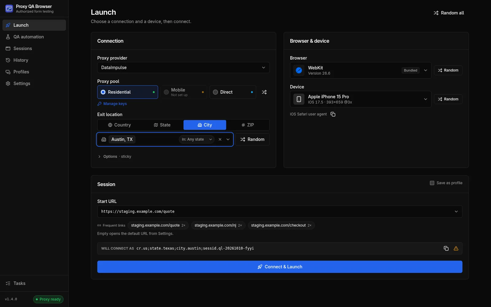

# Introduction

Proxy QA Browser is a free, open-source desktop app for testing your own web forms in real browsers, on emulated devices, through proxy exit IPs whose location is checked before each launch.

## What it does

Proxy QA Browser opens a real browser window inside an isolated, temporary browser profile and routes it either directly or through a proxy exit IP in the location you choose. Before the window opens, the app looks up the exit IP and compares it with the location you asked for, so you know which exit IP and reported location the test traffic uses.

| Area | What you get |
| --- | --- |
| Browsers | Bundled Chromium, Firefox and WebKit, plus installed Google Chrome, Microsoft Edge, Brave, Opera, Opera GX and system Chromium for [cross-browser testing](/use-cases/cross-browser-testing). Vivaldi installs and is detected, but launches fail: Vivaldi 8.2 hangs under automation. See [Browsers](/docs/browsers). |
| Devices | 226 [emulated device presets](/use-cases/device-testing) for phones, tablets and desktops, with viewport, scale factor, touch and user agent. See [Locations and devices](/docs/locations-and-devices). |
| Proxies | DataImpulse (live-tested) and the community-verified Bright Data, Oxylabs, Decodo and IPRoyal, with country, state, city and ZIP targeting and sticky or rotating sessions. See [Proxy providers](/docs/proxy-providers). |
| Evidence | Every launch is recorded locally: exit IP, location verdict, HTTP status, screenshot, captured network requests, and lead or certificate IDs the form returned. See [Launching browsers](/docs/launching). |
| QA automation | Recorded scenarios, datasets, suites, environments, browser/device/location matrices, visual comparisons, consent, accessibility and performance checks, schedules and JSON, JUnit and HTML reports. See [Scenarios and matrices](/docs/automation). |
| CI and AI assistants | A headless command-line runner, a Docker image, a GitHub Action and an MCP server. See [CI runner](/docs/ci-runner) and [MCP server](/docs/mcp-server). |

The app is desktop-only. There is no account, no sign-in, no telemetry and nothing is uploaded. Proxy credentials are encrypted on each computer and never leave it. See [Security and privacy](/docs/security-and-privacy).

## Who it is for

- **QA engineers and testers** who check lead forms, sign-up flows and landing pages across devices, browsers and US locations before and after release, for example [testing a website from different locations](/use-cases/location-testing) or [checking consent disclosures on your lead forms](/use-cases/tcpa-consent-testing).
- **Developers** who want repeatable regression checks of their own forms in CI, or who want to build and extend the app. Start with [Architecture](/docs/architecture) and [Contributing](/docs/contributing).

You do not need a proxy plan to start. Direct (unproxied) launches and QA automation runs without location targets work without one. Location targeting, including location cases in QA automation, needs your own plan with a supported provider.

## Responsible use

Proxy QA Browser is built for **authorized QA testing only**.

- Use it only on forms, funnels and sites that **you own or are explicitly contracted to test**, and only with a proxy plan you are entitled to use.
- It is **not** a tool for evading bot detection, CAPTCHA, rate limits or fraud controls. It does not spoof fingerprints, solve CAPTCHAs or imitate human input to avoid detection, and such features are out of scope for the project.
- Do not generate fake leads, synthetic identities intended to look real to a third party, or bulk submissions to sites you do not control. Do not scrape third parties or impersonate real users.
- If your own site's bot protection blocks your QA runs, allowlist your test traffic on that site instead of working around it. The app supports this with [site access tokens](/docs/site-access-tokens).
- Use synthetic test data and tag test submissions in your form backend so they are never sold, billed, routed to sales or counted in metrics.
- Respect your proxy provider's terms of service and the laws that apply to you.

The full rules are in the [Acceptable use policy](/acceptable-use) and the project scope in [CONTRIBUTING.md](https://github.com/UbaidBinWaris/proxy_browser/blob/main/CONTRIBUTING.md#project-scope).

## Platforms

| Platform | Download | Notes |
| --- | --- | --- |
| Windows 10/11 x64 | Portable EXE | Browser engines download on first run. |
| Linux x86-64 | AppImage | Chromium, Firefox and WebKit are built in. |
| macOS 12+ (Apple silicon and Intel) | DMG (unsigned; open once with **Open Anyway**) | Updates come from the download page. |

See [Install](/docs/install) for details.

## License

Proxy QA Browser is © 2026 Ubaid Bin Waris and licensed under the [Apache License 2.0](https://github.com/UbaidBinWaris/proxy_browser/blob/main/LICENSE). It is an independent open-source project and is not affiliated with or endorsed by any proxy provider or browser vendor. Third-party components and data are listed on the [licenses page](/licenses).

## Next steps

1. [Install](/docs/install) the app for your platform.
2. Complete the [first-run setup](/docs/first-run).
3. [Launch a browser](/docs/launching).
