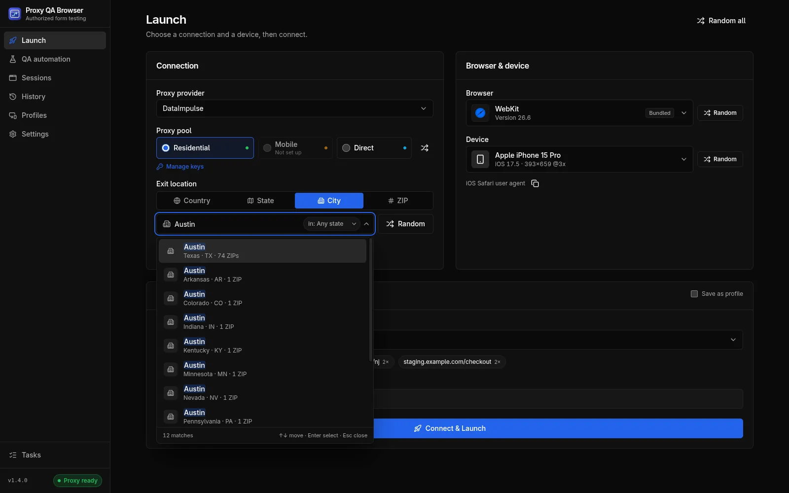
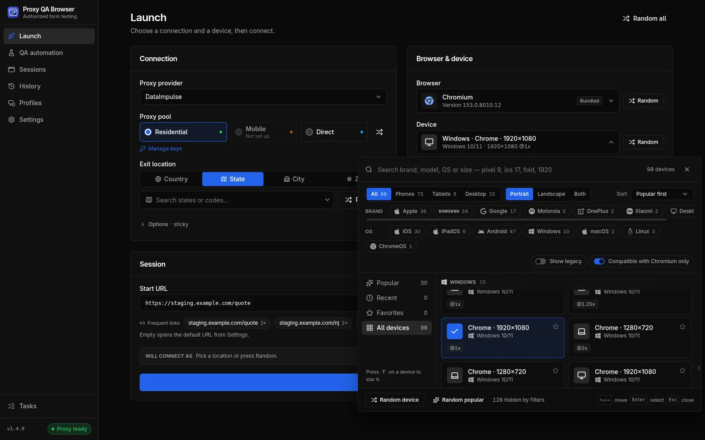

# Locations and devices

Target a country or a US state, city or ZIP code, check the exit IP's reported location before the browser window opens, and emulate any of 226 phone, tablet and desktop presets.

## Choosing a location

On the Launch page, **Exit location** connects by **Country**, **State**, **City** or **ZIP**. It is disabled for Direct. Only the modes the selected provider supports are offered (IPRoyal has no ZIP mode).

- **Country**: a two-letter code. `US` is the default, set under **Settings → Advanced → Targeting & location match → Default country**.
- **State, City, ZIP**: a search field over the bundled US location dataset (51 states including DC, 29,540 cities, 40,977 ZIP codes, from [GeoNames](https://www.geonames.org), CC BY 4.0).
  - With an empty query it lists **Recent** picks and **Popular states** or **Popular cities** (**All states** in State mode).
  - Typing searches case- and accent-insensitively: `new j` finds New Jersey, and `newark nj` narrows a city or ZIP search to one state.
  - City and ZIP searches have an **Any state** filter chip that limits results, and **Random**, to one state.
  - Keyboard: Up and Down move, Enter selects, Esc closes.
- **Random** picks a random state, city or ZIP of the current mode, inside the state filter when one is set. Random states come only from DataImpulse's published list of 50 states; DC is searchable but never picked at random.

Location search runs entirely on your computer and never sends your query anywhere. Recent locations are kept in the app's local storage only.

See it in practice: [test your website from different locations](/use-cases/location-testing).

## Exit-IP verification

To check your proxy's location, the app looks up the exit IP on each launch before the browser opens (or when you click **Test Proxy** on a profile), **through the same proxy login the browser will use**, and compares the reported country, region, city and postal code with your target.

| Badge | Meaning |
| --- | --- |
| **Match** | Every requested level agrees: country; state; the city name for a City target; the **exact ZIP** for a ZIP target |
| **Partial** | Right state, but another city (City target) or another or unreported postal code (ZIP target) |
| **Mismatch** | Another country or another state |
| **Unverified** | No target, or the IP service did not report enough to compare |

For Direct launches the same lookup reports this computer's own IP; if it fails, the launch continues without an IP.

### Location match policy and re-rolls

A sticky session keeps one IP, so a bad draw would last the whole session. For a **sticky session with a target**, the app therefore re-rolls the session ID (`-r2`, `-r3`, …) while the result falls short of the **Location match** policy, up to **Attempts** IP checks in total (first check included; 1–8, default 3). Both settings are under **Settings → Advanced → Targeting & location match**.

| Location match | Re-rolls when the verdict is |
| --- | --- |
| **Off** | Never; the first exit IP is used |
| **Same state** (default) | Mismatch (another state or country) |
| **Exact (city or ZIP)** | Mismatch or Partial; the city name or the exact ZIP must match |

- Each attempt is shown live on the run page, for example *"Exit IP 107.77.76.91 is in New York, NY 10118 — re-rolling session (2/3)…"*, and logged.
- **Rotating sessions are never re-rolled**, and with **Off** or **Attempts = 1** there is exactly one check.
- If the first check fails, the launch fails. A later failed check only costs an attempt, except `PROXY_AUTH_FAILED` and `PROXY_DEAD`, which stop re-rolling at once.
- If no attempt meets the policy, the launch continues with the **best** result (Match, then Partial, then Unverified, then Mismatch; on a tie the later one). Its sticky ID, which still holds that IP, is saved on the profile and used by the browser, and the run shows a warning such as *"Could not get an exit IP in ZIP 07102 (Newark, NJ) after 3 attempts; using Newark, NJ 07103 (same state)"*.

### ZIP targeting caveat

Some ZIP codes have only a handful of exit IPs in a pool, and carrier (mobile network) IPs often geolocate to the carrier's hub instead of the subscriber's town. Every sticky ID that is tried keeps its IP pinned until it expires, so re-rolling a thin ZIP can exhaust it: the gateway then answers **HTTP 503** (`PROXY_DEAD`, *"The proxy gateway had no exit IP available for this session and location right now"*) until a session expires (about 30 minutes, or the TTL).

**Same state** is the pragmatic default. For thin ZIPs, use City or State targeting, rotating mode, or wait.

### IP-check services

The exit IP is looked up with one of three public services, chosen under **Settings → Advanced → IP verification → Provider**:

| Provider | Endpoint | Notes |
| --- | --- | --- |
| `ip-api` (default) | `http://ip-api.com/json/` | Plain HTTP on the free tier |
| `ipinfo` | `https://ipinfo.io/json` | |
| `ipwhois` | `https://ipwho.is/` | |

The timeout is 15,000 ms by default (1,000–120,000) with 2 retries (0–5) and exponential back-off from 500 ms. If the chosen service still fails, the app tries one other service once. A `407` (bad proxy credentials) is never retried. IP geolocation is an estimate by a third party; the app reports what the service says.

## Devices

For a walkthrough, see how to [test your website on different devices](/use-cases/device-testing).

The catalog holds **226 presets**: 198 from Playwright's device descriptors (portrait and landscape) and 28 curated by the project (desktops and current Android phones Playwright lacks). The table shows the preset types with examples.

| Type | Presets | Examples |
| --- | --- | --- |
| Desktop | 18 | Windows · Chrome · 1920×1080 (and HiDPI), Windows 11 1366×768 / 1536×864 / 2560×1440, Windows · Edge, Linux · Chrome, macOS · Chrome, Chromebook, Playwright's Desktop Chrome / Edge / Firefox / Safari |
| Mobile | 184 | iPhone 6 to iPhone 17 Pro Max, 16e, 17e, Air, SE (3rd gen); Pixel 2 to Pixel 10 Pro XL; Galaxy S5 to S25 Ultra, A-series, Z Fold and Z Flip; OnePlus, Xiaomi, Motorola |
| Tablet | 24 | iPad, iPad mini, iPad Pro 11", Galaxy Tab S4 / S9, Nexus 7 / 10, Kindle Fire HDX |

The number changes when Playwright adds devices. 66 discontinued devices carry a **Legacy** badge; they are hidden unless **Show legacy** is on and are never picked at random.

### Device picker

The device field opens a large panel (a centered dialog on windows narrower than 900 px).

- **Search** brand, model, OS or size, for example `pixel 9`, `ios 17`, `fold` or `1920`.
- **Filters**: device type (**All / Phones / Tablets / Desktop**), orientation (**Portrait**, **Landscape**, **Both**), **Sort** (**Popular first**, **Newest**, **Name**, **Screen size**), **Brand** and **OS** chips, **Show legacy** and **Compatible with … only** (the selected browser) (on by default). **Reset filters** appears when anything is narrowed.
- **Lists**: **Popular**, **Recent** (the last 8 devices you chose), **Favorites** and **All devices**.
- **Cards** show OS, viewport, scale factor, **Touch**, **Landscape**, **Legacy** and **Unsupported** badges, and a star to add a favorite.
- **Keyboard**: arrow keys move through the grid, Home and End jump, Enter or Space selects, **F** stars the focused device, typing continues the search, Esc closes.
- **Footer**: **Random device** (among the listed devices) and **Random popular**.

Recent devices and favorites are kept in this computer's app storage only.

### Browser compatibility

| Preset | Works on |
| --- | --- |
| Phones and tablets | WebKit and every Chromium-family browser (bundled and installed). **Never Firefox**: Playwright Firefox cannot emulate mobile devices |
| Most desktop presets | Every engine |
| *macOS · Safari (WebKit)* | WebKit only |
| *Windows · Firefox* | Firefox only |
| Edge user-agent desktops | Chromium family only |

### How emulation is applied

Each session gets its own browser context with the preset's viewport, device scale factor, touch and screen size, `isMobile` for phones and tablets, and the profile's locale and timezone.

User agent rules:

- A user agent typed on the profile always wins.
- Phone and tablet presets always send the device's user agent.
- Desktop presets force their Chrome user agent **only on the bundled Chromium**, a generic test build with no identity of its own. Firefox, WebKit and every installed browser keep their real user agent, so Brave reports as Brave and WebKit never claims to be Chrome.
- A custom viewport stops the preset's physical screen size from being reported.

Device emulation is for layout and behaviour testing of your own pages. It is not designed to disguise the browser from bot detection, and the project does not add such features. See [Responsible use](/docs/introduction#responsible-use).

## Common questions

### How do I check that my proxy's exit IP is in the location I picked?

You do not need a separate checker. Before the browser opens, the app looks up the exit IP through the same proxy login and compares country, region, city and postal code with your target. The run shows **Match**, **Partial**, **Mismatch** or **Unverified**. With a sticky session and a target, the app can retry with a new sticky session until the result meets your **Location match** policy, up to the number of attempts you set (default 3). Otherwise it uses the best result and shows a warning.

### Why did the exit IP land in another city, and how accurate is ZIP targeting?

IP geolocation is a third-party estimate, and your site's own geo-IP database may disagree with it. Some ZIP codes have only a handful of exit IPs, and carrier IPs often geolocate to the carrier's hub. **Same state** is the default match policy. For thin ZIP codes, use City or State targeting, rotating mode, or wait. IPRoyal has no ZIP mode. See [ZIP targeting caveat](#zip-targeting-caveat).
