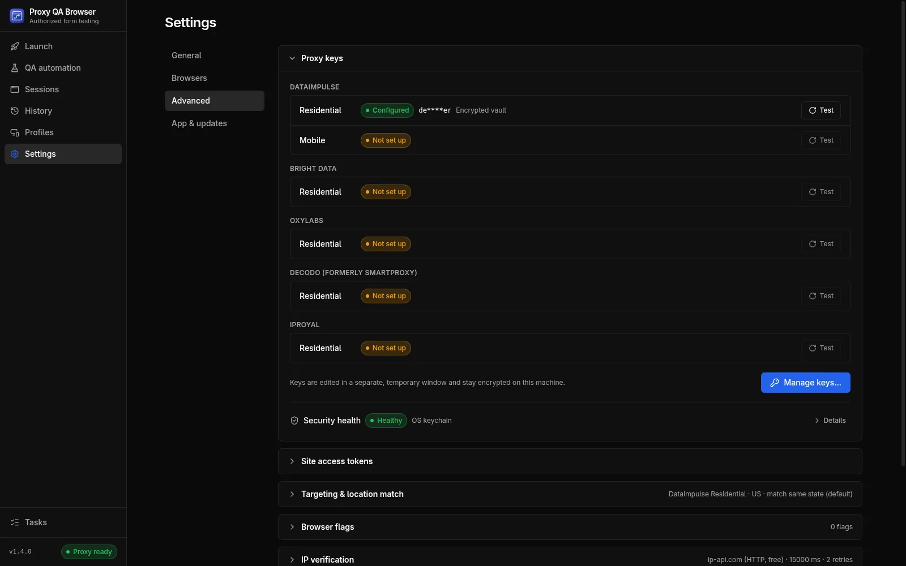

# Proxy providers

Proxy QA Browser builds each provider's login and targeting parameters for you, with DataImpulse live-tested and Bright Data, Oxylabs, Decodo and IPRoyal community-verified.

## Built-in providers

Providers are built into the app; no plug-ins are loaded at runtime, because a provider sees your credentials. Each provider declares its products (plans), target modes, sticky-session rules, default gateway and any extra credential fields, and the Launch page, profile editor, keys window and Settings are built from that.



| Provider | Products | Default gateway | Targeting (US) | Sticky session / TTL | Verification |
| --- | --- | --- | --- | --- | --- |
| **DataImpulse** | Residential, Mobile | `gw.dataimpulse.com:823` | Country, State, City, ZIP | `sessid` + `sessttl` (1–1440 min) | Live-tested |
| **Bright Data** | Residential | `brd.superproxy.io:44445` | Country, State, City, ZIP | `-session-<id>`; no TTL parameter (a session ends after 5 idle minutes) | Community-verified |
| **Oxylabs** | Residential | `pr.oxylabs.io:7777` | Country, State (Oxylabs' 50-state list, no DC), City, ZIP | `-sessid-<id>` + `-sesstime-<1–1440>` | Community-verified |
| **Decodo** (formerly Smartproxy) | Residential | `gate.decodo.com:7000` | Country, State, City, ZIP | `-session-<id>` + `-sessionduration-<1–1440>` | Community-verified |
| **IPRoyal** | Residential | `geo.iproyal.com:12321` | Country, State, City (no ZIP: not documented by IPRoyal) | `_session-<8 characters>` + `_lifetime-<N>m` (up to 7 days) | Community-verified |

> **Note:** **Community-verified** providers were written from each provider's official parameter documentation and **have not been tested with a live account**. The provider pickers label them *(community-verified)* and the keys window says *"Community-verified (not tested with a live account)"*. If a gateway refuses a parameter, check the provider documentation linked from the keys window and [open an issue](https://github.com/UbaidBinWaris/proxy_browser/issues) with the redacted error.

Profiles, quick launches, CLI runs, proxy sessions and run history record which provider they used. Records created before providers were selectable are DataImpulse records.

## Pools, logins and billing

The app stores **one login per provider product**. A product without a login is shown as **Not set up** and cannot be used. **Direct** uses no proxy at all.

- DataImpulse sells **Residential** and **Mobile** as separate plans, each with its own login, on the same gateway. A Residential login is never used for the Mobile pool.
- Each user needs their **own plan** with the provider. Usage is billed by the provider to that plan.
- DataImpulse bills **state, city and ZIP targeting at 2×** and country-only targeting at the normal rate; the launcher warns about it. The community-verified providers document no targeting surcharge, so no billing note is shown for them.
- Every exit-IP check and every location re-roll is one small HTTP request through the proxy.

## DataImpulse username syntax

Parameters are appended to the login after a double underscore: `__` starts the list, `;` separates parameters and `.` separates key and value.

```text
login__cr.us;state.newjersey;city.newark;zip.07102;sessid.ql-20261007-7f3a;sessttl.60
```

| Key | Meaning | Sent when |
| --- | --- | --- |
| `cr` | Country, lower-case ISO-2 | Always with a target (required with `state`, `city` and `zip`) |
| `state` | US state name, encoded | State, City and ZIP targets |
| `city` | City name, encoded | City and ZIP targets |
| `zip` | 5-digit ZIP code | ZIP targets |
| `sessid` | Sticky session ID; keeps the same exit IP | Sticky sessions |
| `sessttl` | Sticky lifetime in minutes (1–1440) | Sticky sessions with a TTL |

- The order is always `cr`, `state`, `city`, `zip`, then any other parameters your saved login already carries, then `sessid`, `sessttl`.
- If your saved login already contains parameters (for example `mylogin__cr.us`), its `cr`, `state`, `city` and `zip` are **replaced** by the launch's target, other parameters are kept, and its `sessid` and `sessttl` are replaced in sticky mode.
- The **Will connect as** preview, the session and the run store only the parameter part (`cr.us;…`). The login and password are added inside the app's main process when the connection is built and are never shown or stored in plain text.

### Place name encoding

Accents and punctuation are removed, the text is lower-cased and `&` becomes `and`. Words are then joined according to **Settings → Advanced → Targeting & location match → Place name encoding**:

| Option | Example |
| --- | --- |
| **Remove spaces (DataImpulse default)** | `newjersey`, `stlouis`, `winstonsalem` |
| **Replace spaces with underscores** | `new_jersey` |
| **Keep spaces** | `new jersey` |

Keep the default unless DataImpulse tells you otherwise; its published state list uses the remove-spaces form.

### Sticky session template

The `sessid` part is added through a template. The default is `{username}{sep}sessid.{session}`, where `{username}` is the login with its parameters, `{session}` is the session ID and `{sep}` is `;` when the login already contains `__`, otherwise `__`. You can save a different template with a product's credentials under *Advanced: sticky session template*; it must contain `{username}` and `{session}`. `sessttl` is appended after the template. Only DataImpulse supports templates.

## Community-verified providers in detail

| Provider | Where parameters go | Example parameters |
| --- | --- | --- |
| Bright Data | Username: the zone username (`brd-customer-EXAMPLE-zone-EXAMPLE`) plus parameters | `-country-us`, `-state-nj` (USPS code), `-city-newark`, `-city-newark-zip-07102` |
| Oxylabs | Username: `customer-<user>` plus parameters | `-cc-US`, `-st-us_new_jersey`, `-cc-US-city-newark`, `-cc-US-postalcode-07102` |
| Decodo | Username: `user-<user>` plus parameters | `-country-us`, `-state-us_new_jersey`, `-state-…-city-newark`, `-zip-07102` |
| IPRoyal | **Password**: `<password>` plus parameters; the username is sent unchanged | `_country-us_state-newjersey`, `_city-newark` |

These providers accept only certain sticky session IDs (letters and digits only; IPRoyal exactly 8 characters). The app maps your session ID to a deterministic alphanumeric token, so a profile ID such as `profile-qa-1` is sent in a form the provider accepts and stays the same across launches. State and ZIP targeting for these providers is accepted only for United States targets.

## Sticky and rotating sessions

| Mode | Behaviour |
| --- | --- |
| **Sticky** (default) | A session ID pins one exit IP for about 30 minutes (DataImpulse default) or for **Session TTL** minutes. Quick launches generate a fresh ID per launch, `ql-<YYYYMMDD>-<4 random characters>`. Saved profiles use their **Sticky session ID**; a sticky profile without one gets `profile-<name>` generated and saved on first use |
| **Rotating** (Sticky session off) | No session ID or TTL is sent; every request may use a different exit IP |

**Rotate** under **Settings → Advanced → Proxy session history** appends `-r2`, `-r3`, … to a profile's ID. That is a new sticky session, normally with a new exit IP, and the app tests it at once.

Before the browser opens, the app verifies the exit IP and, for sticky sessions with a target, can re-roll the session until the location matches. See [Exit-IP verification](/docs/locations-and-devices#exit-ip-verification).

## Custom gateways (QA automation)

QA automation can also use a gateway of any other provider. In **QA automation → Data controls → Custom proxy gateways**, save an HTTP or HTTPS gateway (with optional username and password) or an unauthenticated SOCKS5 gateway, then select it in a scenario. It overrides the base profile's proxy and target.

- Credentials are encrypted with the operating system keychain; unsupported Linux keychain backends are refused.
- WebKit requires an HTTP gateway.
- Provider-specific location and sticky parameters are not applied. Put the other provider's targeting syntax in the username if needed.

Custom gateways are for automation only; manual launches use the built-in providers. See [Scenarios and matrices](/docs/automation).

## Adding a provider

Providers are added in code, one dialect file per provider, with a golden-table test taken from the provider's documented examples. See [Contributing](/docs/contributing#adding-a-proxy-provider).
