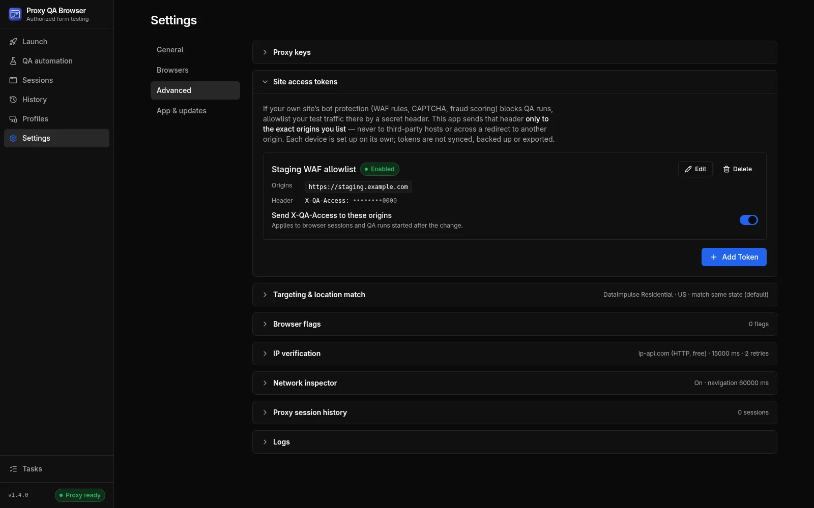

# Site access tokens

A site access token is a secret header you define that the app sends only to the exact origins you list, so your own WAF, CAPTCHA or fraud scoring can recognize and allow your QA traffic.

## When to use them

If **your own** site's bot protection (Cloudflare or Akamai WAF rules, reCAPTCHA, Turnstile or hCaptcha, internal fraud scoring) blocks your QA runs, do not try to get past it. Allowlist your test traffic on that site instead.

A site access token is a header such as `X-QA-Access: <long random value>` that your site or WAF accepts as "this is our QA traffic".

> **Note:** This is an allowlisting feature for sites you own or are contracted to test, configured with the site owner's agreement on the site itself. It is **not** an evasion feature. It cannot change the user agent, cookies, client IP or any browser-controlled header, and it sends nothing to sites you did not list. The project does not provide, and will not accept, features for bypassing bot detection, CAPTCHA or fraud controls of anyone's site. See the [Acceptable use policy](/acceptable-use).

Use tokens together with synthetic test data, and tag every submission that carries the header as a test lead so it is never sold, billed or counted. Do not use them to create fake leads.

## Set up a token

Open **Settings → Advanced → Site access tokens** and click **Add Token**.

| Field | Rules |
| --- | --- |
| **Name** | Free text, shown in lists and in evidence |
| **Origins** | 1–20 exact origins, one per line: scheme, host and port, for example `https://staging.example.com` or `https://staging.example.com:8443`. HTTPS only; plain HTTP only for `localhost`, `127.0.0.1` and `[::1]`. No wildcards, subdomains or paths. Case, IDN (punycode) and default ports are normalized |
| **Header name** | An HTTP token such as `X-QA-Access`. Refused: `Host`, `Cookie`, `Authorization`, `Proxy-Authorization`, `Content-Length`, `Content-Type`, `Origin`, `Referer`, `User-Agent`, connection headers, every `Sec-*`, `Proxy-*` and `X-Forwarded-*` header, and client-IP headers (`Forwarded`, `X-Real-IP`, `True-Client-IP`, `CF-Connecting-IP`) |
| **Secret value** | 1–4096 printable ASCII characters. Write-only: after saving, the app shows only `••••••••` plus the last 4 characters of a value of 16 or more characters. Editing without a new value keeps the saved one |
| **Enabled** | Only enabled tokens are applied |

Two tokens may not send the same header name to the same origin; this is refused when you save. Changes apply to browser sessions and QA runs **started afterwards**. Use **Edit** and **Delete** (with confirmation) to manage tokens.

## Configure your site

On your staging or QA environment:

1. Add a WAF rule that skips bot and challenge rules **only** when the header matches the secret and the host is your staging host. On Cloudflare, use *WAF custom rules* with the *Skip* action; on Akamai, a request-header match in a security-policy exception. Rotate the value like any other secret.
2. Use your CAPTCHA vendor's **test keys** on staging instead of solving challenges (reCAPTCHA *test keys*, Cloudflare Turnstile *testing* dummy keys, hCaptcha *test keys*).
3. Tag every submission that carries the header as a **test lead** in your form backend, so it is never sold, billed, routed to sales or counted in metrics.

## What is sent where

- **Exact origin only.** A request gets the header only when its own origin (scheme, host and port) is in the list. Third-party scripts, images, APIs and analytics on the same page never get it.
- **Redirects never carry it to another origin.** For tokenized requests the app performs the request itself, through the same proxy and cookie jar, with redirects disabled. A page redirect becomes a fresh navigation to the new URL, which gets the header only if that origin is listed (so `POST /submit → 303 /thanks` on your site keeps it). A 307 or 308 redirect of a form POST is blocked, because the body cannot be re-sent safely. A sub-resource redirect is followed by Chromium and Firefox without the header; WebKit cannot do that, so there the sub-resource fails instead.
- **File uploads** to a listed origin work on every engine. On listed pages only, the app keeps the files you pick in `<input type=file>` in memory for that browser session (up to 25 MB each, 50 MB in total) and sends them with the upload. If the bytes are not available (a larger file, or a form on another site posting to the listed origin), the upload is **blocked with a message** rather than sent as an empty file. Files are never read on other sites.
- **Not covered** (the header is simply absent): requests answered by a service worker, WebSockets, and the very first request of a pop-up in a QA run.

Side effects while a token is enabled:

- The HTTP cache of that browser context is disabled.
- Tokenized responses are buffered before the page sees them, so streaming and server-sent events from those origins do not stream.
- In Chromium, a page served this way counts as "public network" for Local Network Access, so it may need permission to call `localhost` or private-network hosts on **other** origins.

## Storage and evidence

- Tokens are stored per device in `<userData>/data/site-access-tokens.json` (owner-only). Names, origins and header names are plain; the value is encrypted with the operating system keychain (Windows DPAPI, macOS Keychain, GNOME Keyring / libsecret or KWallet). Without a usable keychain (Linux `basic_text` or unknown backends), tokens can be neither saved nor applied.
- Tokens are **not** synced, and not part of encrypted configuration backups, scenario or suite exports, or the CI runner. A file copied to another computer does not decrypt there; the list then shows *Re-enter value*.
- Every value is registered with the log redactor. Logs, reports and diagnostics never contain it.
- Runs record only the token name and the origin, for example `site access token "Staging" applied to https://staging.example.com`: as an INFO log line for launches, and in the case `notes` for QA automation results. Never the value.
- Playwright traces record raw request headers, so while any token is enabled a QA run skips its opt-in trace and notes *"Trace capture skipped: site access tokens are enabled…"*.

## In automation and CI

Enabled tokens apply to every QA automation run and to the recorder in the desktop app, with the same exact-origin and redirect rules.

The [CI runner](/docs/ci-runner), its Docker image, the GitHub Action and the [MCP server](/docs/mcp-server) cannot use tokens, by design. In CI, allowlist the runner's traffic on your site instead, for example a staging environment that accepts the CI network, or test keys from your bot-protection vendor, configured on the site rather than in the manifest.
